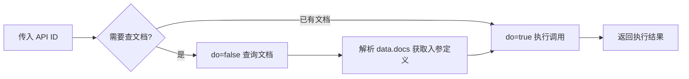

# 工作流



## 第一步

当**首次调用**或**不确定入参结构**时，先查询文档。

### 请求

| 项目   | 值                                |
| ---- | -------------------------------- |
| 接口地址 | `https://abc.feg.com.tw/oauth2/fdep`   |
| 请求方式 | `POST`                           |
| 请求头  | `Content-Type: application/json` |

```json
{
  "api": "<API_ID>",
  "do": false,
  "inbound": {}
}
```

> 注意：`do: false` 表示仅查询文档，不执行业务逻辑。`inbound` 传空对象即可，文档查询不依赖具体参数。

### 响应

```json
{
  "data": {
    "docs": {
      "desc": "接口功能描述",
      "name": "参数1",
    },
    "flow": "流程图字符串（调试用，可忽略）"
  },
  "trace_id": "xxx"
}
```

#### docs 字段解读规则

- `docs.desc` → 接口功能说明（**不**作为请求参数）
- `docs` 中**除 `desc` 外的其他字段** → 接口所需的入参字段名及说明
- 根据字段名和说明，由用户或上下文提供对应值

## 第二步：执行 API 调用

拿到文档后，按 `docs` 中的字段（排除 `desc`）组装 `inbound`。

### 请求
| 项目   | 值                                |
| ---- | -------------------------------- |
| 接口地址 | `https://abc.feg.com.tw/oauth2/fdep`   |
| 请求方式 | `POST`                           |
| 请求头  | `Content-Type: application/json` |

```json
{
  "api": "<API_ID>",
  "do": true,
  "inbound": {
    "name": "aaa"
  }
}
```

> 关键：`inbound` 的键名必须与 `docs` 中除 `desc` 外的字段名完全一致。

## 完整示例

### 场景：调用 test.demo 接口

#### 1. 查询文档

##### 请求：
```json
{
  "api": "test.demo",
  "do": false,
  "inbound": {}
}
```

##### 响应：
```json
{
  "data": {
    "docs": {
      "desc": "最简单的示例",
      "name": "aaa"
    },
    "flow": "flowchart TD\n  subgraph Flow[\"Flow\"]\n    N2@{ label: '获取数据' }\n  end"
  },
  "trace_id": "f554b70e-cbc7-40f9-b6e5-463e1be02cd9",
  "root_path": ""
}
```

#### 2. 分析文档

从`docs`提取入参字段（排除`desc`）：
| 字段名        | 需提供的值              |
| ---------- | ------------------ |
| `name` | `aaa`         |


#### 3. 执行调用

##### 请求：
```json
{
  "api":"test.demo",
  "do":true,
  "inbound": {
    "name":"aaa"
  }
}
```